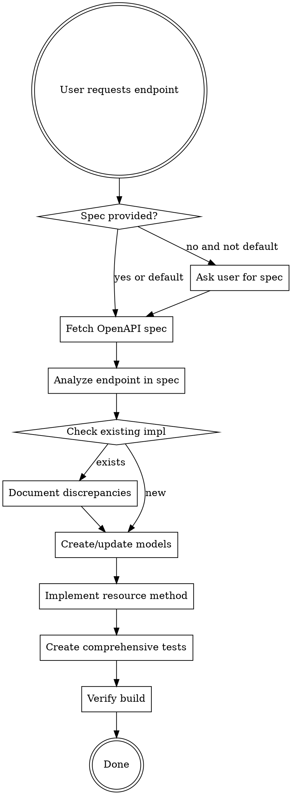

# Implement API Endpoint

## Overview

Implementing SDK endpoints requires spec-first development: fetch the OpenAPI specification, verify exact request/response structure, follow SDK architectural patterns, and create comprehensive tests. The API specification is the source of truth, not existing code.

## When to Use

Use this skill when:
- Implementing new API endpoints in the SDK
- Modifying existing endpoint implementations  
- Adding or updating request/response models
- Asked to "add endpoint", "implement API", or "support new operation"

Use BEFORE writing any code or tests.

## The Iron Law

**THE API SPECIFICATION IS THE SOURCE OF TRUTH. CODE VALIDATES AGAINST SPEC, NOT VICE VERSA.**

Never trust existing patterns without spec verification - patterns can propagate bugs.

## Quick Reference

| Step | Action | Why |
|------|--------|-----|
| 1. Fetch Spec | Get OpenAPI JSON for the endpoint | Source of truth for all implementation decisions |
| 2. Analyze Spec | Extract request params, response schema, required fields | Prevents assumptions and circular validation |
| 3. Map Models | Verify/create C# models matching spec exactly | Type safety and API contract compliance |
| 4. Implement | Follow AbstractResources pattern from ADVANCED.md — sync method AND `*Async` counterpart | Consistency with SDK architecture; async is mandatory |
| 5. Test Comprehensively | URL, request body, all response properties, errors — sync AND async | Spec compliance verification, not code validation |

## Implementation Workflow



### Step 1: Obtain OpenAPI Specification

**Default spec location:** https://developers.smartsheet.com/_spec/api/smartsheet/openapi.json

If endpoint is NOT in the public spec, ask user for spec location.

**Fetch the spec before any implementation work:**

```bash
curl -s https://developers.smartsheet.com/_spec/api/smartsheet/openapi.json > /tmp/smartsheet-openapi.json
```

Or use WebFetch if available.

### Step 2: Analyze Endpoint in Specification

For the target endpoint, extract from OpenAPI spec:

**Path and method:**
- Exact path (e.g., `/reports/{reportId}`)
- HTTP method (GET, POST, PUT, DELETE)

**Request parameters:**
- Path parameters with types
- Query parameters with types, required/optional, enum values
- Request body schema if POST/PUT

**Response schema:**
- Response object structure
- Required vs optional properties
- Nested object schemas
- Array item schemas
- Property types and formats
- Enum values for string properties

**Error responses:**
- Expected error codes (400, 404, 500, etc.)

### Step 3: Verify/Create Models

**Compare spec schema to existing C# models:**

1. Check if model classes exist (e.g., `Report.cs`, `ReportInclusion.cs`)
2. Verify ALL properties from spec are in model
3. Verify NO extra properties exist in model that aren't in spec
4. Check property types match (string, long, bool, nested objects)
5. Check enum values match exactly

**Common discrepancies:**
- Missing properties in model
- Extra properties not in spec (tech debt)
- Wrong property types
- Missing enum values
- Extra enum values not in API

**Document any discrepancies** before implementation. If models don't match spec, UPDATE MODELS FIRST.

### Step 4: Implement Resource Method

Follow SDK architectural patterns from ADVANCED.md:

**Resource organization:**
- Top-level resources: `{Resource}ResourcesImpl` extends `AbstractResources`
- Associated resources: `{Parent}{Resource}ResourcesImpl` extends `AbstractAssociatedResources`

**Method signature pattern:**

```csharp
public virtual {ReturnType} {MethodName}({parameters})
{
    // 1. Build query parameters from method parameters
    IDictionary<string, string> parameters = new Dictionary<string, string>();
    if (paramName != null)
    {
        parameters.Add("paramName", paramValue.ToString());
    }
    
    // 2. Choose appropriate helper method based on HTTP method and response type
    // - GetResource<T>(path) for GET returning single object
    // - ListResourcesWithWrapper<T>(path) for GET returning paginated list
    // - CreateResource<T>(path, body) for POST
    // - UpdateResource<T>(path, body) for PUT
    // - DeleteResource<T>(path) for DELETE
    
    return this.GetResource<ReturnType>("path" + QueryUtil.GenerateUrl(null, parameters));
}
```

**Key patterns from ADVANCED.md:**
- Use `CreateHttpRequest()` from AbstractResources for header injection
- Use `QueryUtil.GenerateUrl()` for query parameter formatting
- Use `this.ListResourcesWithWrapper<T>()` for paginated endpoints
- Use `this.GetResource<T>()` for single object endpoints
- Exceptions throw automatically via `HandleError()` - no manual exception handling needed

**Async counterpart (MANDATORY):**

Every new or modified endpoint must ship an `*Async` method alongside the synchronous one. Declare it on BOTH the public interface and the `*Impl` class.

```csharp
// Public interface — async mirrors sync with Async suffix, Task<T> return, trailing CancellationToken
Task<ReturnType> MethodNameAsync(/* same params */, CancellationToken cancellationToken = default);

// Impl — build params identically, await an async helper with ConfigureAwait(false)
public virtual async Task<ReturnType> MethodNameAsync(/* same params */, CancellationToken cancellationToken = default)
{
    IDictionary<string, string> parameters = new Dictionary<string, string>();
    // ... populate parameters exactly as the sync method does ...

    return await this.GetResourceAsync<ReturnType>(
        "path" + QueryUtil.GenerateUrl(null, parameters),
        typeof(ReturnType),
        cancellationToken).ConfigureAwait(false);
}

// Sync method delegates to async — NOT .Wait()/.Result, NOT AggregateException unwrap
public virtual ReturnType MethodName(/* same params */)
{
    return this.MethodNameAsync(/* same params */).GetAwaiter().GetResult();
}
```

Use the async helper matching the HTTP verb: `GetResourceAsync`, `CreateResourceAsync`, `UpdateResourceAsync`, `DeleteResourceAsync`, `ListResourcesWithWrapperAsync`, `ListResourcesWithTokenWrapperAsync`, `CreateResourceWithAttachmentAsync`. Pass `cancellationToken` through every await. See ADVANCED.md "Asynchronous API (Task-based Methods)" for the full convention.

### Step 5: Create Comprehensive Tests

**Test file location:** `/mock-api-test-sdk-net80/{ResourceName}Test.cs`

**Required test categories (see AssetSharingResourcesContractTest.cs pattern):**

#### 1. URL Generation Tests

Verify correct URL construction with all parameters:

```csharp
[TestMethod]
public async Task Test{Method}GeneratedUrlIsCorrect()
{
    Guid requestId = Guid.NewGuid();
    SmartsheetClient smartsheet = HelperFunctions.SetupClient("/path/to/mock", requestId.ToString());
    
    // Call method with all parameters
    smartsheet.ResourceName.Method(params);
    
    // Verify URL and query parameters
    WiremockHelper wiremockHelper = new WiremockHelper();
    LogModel foundRequest = await wiremockHelper.FindWiremockRequestAsync(requestId.ToString());
    Assert.IsNotNull(foundRequest);
    
    var uri = new Uri(foundRequest.AbsoluteUrl);
    var queryParams = HttpUtility.ParseQueryString(uri.Query);
    
    Assert.AreEqual("/expected/path", uri.AbsolutePath);
    Assert.AreEqual(expectedValue, queryParams["paramName"]);
}
```

#### 2. Response Property Tests

**Test required properties:**

```csharp
[TestMethod]
public void Test{Method}RequiredResponseProperties()
{
    // Test with minimal response containing only required fields
    // Verify all required properties are present and correctly typed
}
```

**Test all properties:**

```csharp
[TestMethod]
public async Task Test{Method}AllResponseProperties()
{
    Guid requestId = Guid.NewGuid();
    SmartsheetClient smartsheet = HelperFunctions.SetupClient("/path/all-response-body-properties", requestId.ToString());

    ResultType result = smartsheet.ResourceName.Method(REQUEST_ALL);

    WiremockHelper wiremockHelper = new WiremockHelper();
    LogModel foundRequest = await wiremockHelper.FindWiremockRequestAsync(requestId.ToString());

    Assert.AreEqual(EXPECTED_ALL_REQUEST_BODY, foundRequest.Body);
    Assert.AreEqual(JsonConvert.SerializeObject(EXPECTED_ALL_RESPONSE), JsonConvert.SerializeObject(result));
}
```

Define expected request bodies and responses as static constants:

```csharp
private static readonly string EXPECTED_ALL_REQUEST_BODY = JsonConvert.SerializeObject(new Dictionary<string, object>
{
    { "propertyName", "value" },
    { "nestedObject", new Dictionary<string, object> { { "key", "val" } } }
});

private static readonly ResultType EXPECTED_ALL_RESPONSE = new ResultType
{
    Id = 987654321L,
    Name = "example"
    // ... all properties from spec
};
```

**CRITICAL:** Compare test assertions against OpenAPI spec, not existing code.

#### 3. Parameter Variation Tests

For each query parameter, test:
- Parameter present in URL when provided
- Parameter absent when not provided
- Enum values if applicable
- Multiple values if array parameter

#### 4. Error Response Tests

Test expected error codes from spec:

```csharp
[TestMethod]
public void Test{Method}Error404Response()
{
    SmartsheetClient smartsheet = HelperFunctions.SetupClient("/errors/404-response", Guid.NewGuid().ToString());
    
    ResourceNotFoundException exception = Assert.ThrowsException<ResourceNotFoundException>(
        () => smartsheet.ResourceName.Method(params)
    );
}
```

Minimum error tests: 400, 404, 500

#### 5. Request Body Tests (POST/PUT)

Verify request body JSON matches spec. Define the expected body as a serialized dictionary constant and compare against `foundRequest.Body`:

```csharp
private static readonly string EXPECTED_REQUEST_BODY = JsonConvert.SerializeObject(new Dictionary<string, object>
{
    { "fieldName", "value" },
    { "nested", new Dictionary<string, object> { { "key", "val" } } }
});

// In test:
LogModel foundRequest = await wiremockHelper.FindWiremockRequestAsync(requestId.ToString());
Assert.AreEqual(EXPECTED_REQUEST_BODY, foundRequest.Body);
```

#### 6. Async Tests (MANDATORY — full parity)

Every required sync test needs an `*Async` counterpart: `Test{Method}AsyncGeneratedUrlIsCorrect`, `Test{Method}AsyncAllResponseBodyProperties`, `Test{Method}AsyncError400Response`, `Test{Method}AsyncError500Response`. Reuse the same expected-body/response constants as the sync tests.

```csharp
[TestMethod]
public async Task Test{Method}AsyncAllResponseProperties()
{
    Guid requestId = Guid.NewGuid();
    SmartsheetClient smartsheet = HelperFunctions.SetupClient("/path/all-response-body-properties", requestId.ToString());

    ResultType result = await smartsheet.ResourceName.MethodAsync(REQUEST_ALL);

    WiremockHelper wiremockHelper = new WiremockHelper();
    LogModel foundRequest = await wiremockHelper.FindWiremockRequestAsync(requestId.ToString());
    Assert.AreEqual(EXPECTED_ALL_REQUEST_BODY, foundRequest.Body);
    Assert.AreEqual(JsonConvert.SerializeObject(EXPECTED_ALL_RESPONSE), JsonConvert.SerializeObject(result));
}

[TestMethod]
public async Task Test{Method}AsyncError404Response()
{
    SmartsheetClient smartsheet = HelperFunctions.SetupClient("/errors/404-response", Guid.NewGuid().ToString());

    await HelperFunctions.AssertRaisesExceptionAsync<ResourceNotFoundException>(
        () => smartsheet.ResourceName.MethodAsync(params),
        "Not Found");
}
```

Async tests are `public async Task` (never `async void`); error cases use `AssertRaisesExceptionAsync` (not the sync `AssertRaisesException`). See TESTING.md "Async Test Requirements" and `mock-api-test-sdk-net80/SheetAsyncTests.cs`.

### Step 6: Verify Build

```bash
cd smartsheet-csharp-sdk
dotnet build
```

All tests must compile. Running tests requires WireMock stubs (separate concern).

## Common Mistakes

| Mistake | Fix |
|---------|-----|
| "Existing code is correct, I'll follow that pattern" | Existing code may have bugs. Validate against spec FIRST. |
| "I'll write tests based on the implementation" | This is circular validation. Tests validate SPEC compliance. |
| "Quick implementation, I'll check spec later" | Spec comes FIRST. Otherwise you implement wrong then refactor. |
| "Required properties are obvious" | Only spec `"required": []` array defines required. Check it. |
| "I'll test main cases, skip edge cases" | Test EVERY property, EVERY parameter, EVERY error code from spec. |
| "Enum values seem standard" | Enum values change. Verify against spec exactly. |
| "I'll add the async version later" | Async is mandatory. Ship sync + `*Async` together, both tested. |
| "Sync can just call `.Result` on the async method" | Use `.GetAwaiter().GetResult()`. `.Result`/`.Wait()` wrap errors in `AggregateException`. |

## Red Flags - STOP and Check Spec

- "This looks similar to {other endpoint}"
- "I'll base it on {existing resource}"
- "Required properties are probably..."
- "Let me implement first, then validate"
- "Tests based on code are good enough"
- "Spec check can wait until later"
- "I implemented the sync method, async can follow in another PR"
- "The async method doesn't need its own tests, it shares the code path"

**All of these mean: STOP. Fetch OpenAPI spec. Validate BEFORE coding.**

## Spec-First Development Saves Time

| Without Spec | With Spec |
|--------------|-----------|
| Implement based on assumptions | Implement based on facts |
| Tests validate wrong behavior | Tests validate spec compliance |
| Find bugs in production | Find bugs at implementation |
| Refactor after discovering issues | Get it right first time |
| 2-4 hours: implement + debug + fix | 30 minutes: spec analysis + implement |

Checking spec takes 5 minutes. Fixing wrong implementation takes hours.

## OpenAPI Spec Structure Reference

**Finding your endpoint:**

```json
{
  "paths": {
    "/reports/{reportId}": {
      "get": {
        "parameters": [...],
        "responses": {
          "200": {
            "content": {
              "application/json": {
                "schema": { "$ref": "#/components/schemas/Report" }
              }
            }
          }
        }
      }
    }
  },
  "components": {
    "schemas": {
      "Report": {
        "required": [],  // Array of required property names
        "properties": {
          "id": { "type": "integer" },
          "name": { "type": "string" }
        }
      }
    }
  }
}
```

**Required fields:** Only properties listed in `"required"` array are required. If `"required": []`, ALL properties are optional.

## Cross-References

- **SDK Architecture:** See ADVANCED.md sections:
  - Request Lifecycle
  - Response Handling
  - Resource Organization
  - Error Handling and Exceptions
- **Test Patterns:** See AssetSharingResourcesContractTest.cs for complete test example
- **Existing Resources:** See SheetResourcesImpl.cs for resource implementation pattern

## Real-World Impact

Following spec-first development:
- ✅ Catches API contract violations at implementation
- ✅ Tests verify correct behavior, not incorrect patterns
- ✅ Enum values stay synchronized with API
- ✅ Required vs optional properties are accurate
- ✅ New properties added to API are immediately visible as missing

Example from baseline testing: Found ReportInclusion enum missing `PROOFS` and containing invalid `SHEET_VERSION` by checking spec.
