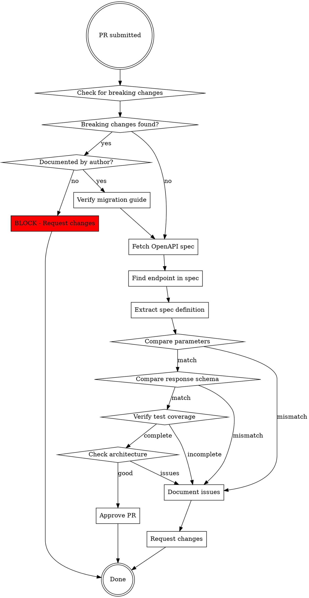

# Review API Endpoint

## Overview

Code review for API endpoints requires spec-first verification: fetch the OpenAPI specification, validate request/response mapping, verify test completeness, then evaluate architecture. Spec compliance is non-negotiable - architectural quality comes second.

**Core principle:** A beautifully architected implementation of the wrong API is worse than a messy implementation of the right API.

## When to Use

Use this skill when:
- Reviewing PRs that implement new API endpoints
- Reviewing PRs that modify existing endpoint implementations
- Reviewing changes to request/response models
- Evaluating test coverage for endpoint functionality
- Approving or requesting changes on API-related code

Use BEFORE giving approval or feedback.

## The Iron Law

**SPEC VERIFICATION IS MANDATORY STEP 1. NEVER APPROVE WITHOUT IT.**

Don't assume:
- Implementation is correct because tests pass
- Experienced authors don't make spec mistakes
- Code patterns imply correctness
- Architectural soundness means functional correctness

## CRITICAL: Breaking Changes Check

**⚠️ BREAKING CHANGES TO PUBLIC API ARE EXTREMELY SERIOUS ⚠️**

Before ANY other review activity, check if this PR breaks the public SDK contract. Breaking changes without explicit documentation and migration path can cause production failures for all SDK users.

### What Counts as Breaking

**ALWAYS BREAKING:**
- Removing public methods/properties
- Changing method signatures (parameters, return types)
- Changing property types
- Removing parameters from existing methods
- Changing parameter order
- Making optional parameters required
- Removing enum values that users may be using
- Renaming public classes, methods, or properties
- Changing exception types thrown by methods
- Changing an existing `*Async` method signature (params, return type, removing the `CancellationToken`)
- Altering the `HttpClient` interface, `RequestAsync`, `ShouldRetryAsync`, or `RetrySleep` contracts (e.g. the v6 PR #195 made `RetrySleep` async — a documented breaking change)

**NOT BREAKING:**
- Adding new methods (overloads OK if old signature kept)
- Adding optional parameters at END of list (C# default parameters)
- Adding new enum values
- Adding new optional properties to models
- Marking methods as `[Obsolete]` while keeping them functional
- Internal/private implementation changes

### Mandatory Breaking Changes Review

**For ANY change to public method signatures, ask:**

1. **Is the old signature still available?**
   - ✅ SAFE: Old signature kept with `[Obsolete]` attribute
   - ❌ BREAKING: Old signature removed

2. **Can existing code compile without changes?**
   - ✅ SAFE: Existing calls still compile
   - ❌ BREAKING: Existing calls fail to compile

3. **Is breaking change documented?**
   - ✅ PR description explicitly states "BREAKING CHANGE"
   - ✅ Migration guide provided
   - ✅ CHANGELOG updated with breaking changes section
   - ❌ No mention of breaking changes

### The Breaking Changes Rule

**IF breaking changes found AND NOT explicitly documented by author:**

```
IMMEDIATELY REQUEST CHANGES

Required actions:
1. Author MUST acknowledge this is a breaking change
2. Author MUST provide migration guide showing old → new code
3. Author MUST update CHANGELOG under "Breaking Changes"
4. Author MUST confirm major version bump planned (e.g., v6.x → v7.0)
5. Consider: Can this be made non-breaking by keeping old signature with [Obsolete]?
```

**ONLY IF author explicitly states "This PR introduces breaking changes" in description:**
- Verify migration guide exists
- Verify CHANGELOG documents breaking changes
- Verify version bump planned
- Then proceed with normal review

### Why This Is Critical

**Breaking changes without warning:**
- Break production code for ALL SDK users
- Cause compilation failures on SDK upgrade
- Lead to emergency rollbacks and hotfixes
- Damage user trust in SDK stability
- Violate semantic versioning contract

**One undocumented breaking change can break thousands of production applications.**

### Examples

**❌ BREAKING - Block This:**
```csharp
// Before (v6.7.0)
Report GetReport(long id, IEnumerable<ReportInclusion>? include);

// After (PR) - OLD SIGNATURE REMOVED
Report GetReport(long id, ReportOptions options);
```
**Impact:** Every single existing call to `GetReport()` will fail to compile.

**✅ NON-BREAKING - Safe:**
```csharp
// Before (v6.7.0)
Report GetReport(long id, IEnumerable<ReportInclusion>? include);

// After (PR) - OLD SIGNATURE KEPT
[Obsolete("Use GetReport(long id, ReportOptions options) instead. Will be removed in v8.0.0")]
Report GetReport(long id, IEnumerable<ReportInclusion>? include);

Report GetReport(long id, ReportOptions options);  // New signature added
```
**Impact:** Existing code continues working, gets deprecation warnings, has time to migrate.

### Common Rationalizations to REJECT

| Excuse | Reality |
|--------|---------|
| "Tests all pass, so it's safe" | Tests were updated. User code was not. |
| "It's a better API" | Better API doesn't justify breaking user code. |
| "Old signature was inconsistent" | Fix with non-breaking addition, deprecate old. |
| "Users should update their code" | Users update when THEY choose, not when forced. |
| "It's just a refactor" | Signature changes are never "just refactors". |
| "Build is green" | User builds will be red. |

**NEVER accept these rationalizations. Breaking changes require explicit acknowledgment.**

## Quick Reference

| Step | Action | Why |
|------|--------|-----|
| 0. Check Breaking Changes | Verify public API compatibility | Breaking changes break all user code |
| 1. Fetch Spec | Get OpenAPI JSON for the endpoint | Source of truth for review decisions |
| 2. Compare Parameters | Verify ALL query/path/body params match spec | Missing parameters = incomplete functionality |
| 3. Verify Models | Check response properties align with spec exactly | Wrong mapping = API contract violation |
| 4. Validate Tests | Confirm tests cover ALL spec-defined properties | Gaps in tests = unverified functionality |
| 5. Verify Async Parity | Confirm `*Async` method exists with full async test coverage | Async is a mandatory, blocking requirement |
| 6. Check Architecture | Evaluate patterns, deprecations, code quality | Only after functional correctness verified |

## Review Workflow



### Step 1: Fetch OpenAPI Specification

**Default spec location:** https://developers.smartsheet.com/_spec/api/smartsheet/openapi.json

**Fetch the spec before any review commentary:**

```bash
curl -s https://developers.smartsheet.com/_spec/api/smartsheet/openapi.json > /tmp/smartsheet-openapi.json
```

Or use WebFetch if available.

**No exceptions:**
- Not for experienced authors
- Not if tests pass
- Not if build is green
- Not if PR looks simple
- Not if time-pressed

### Step 2: Extract Endpoint Definition from Spec

For the PR's target endpoint, extract:

**Path and method:**
- Exact path template (e.g., `/workspaces/{workspaceId}/folders`)
- HTTP method (GET, POST, PUT, DELETE)

**ALL request parameters:**
- Path parameters (`{workspaceId}`)
- Query parameters with types and required/optional flags
- Request body schema for POST/PUT
- Enum values for string parameters

**Response schema:**
- Full object structure with ALL properties
- Required vs optional properties (check `"required"` array)
- Nested object schemas
- Array types
- Enum values

**Expected errors:**
- Error codes defined in spec (typically 400, 404, 500)

### Step 3: Compare Implementation to Spec

#### Parameters Verification

Create checklist of ALL spec parameters:

```markdown
**Spec Parameters:**
- [ ] workspaceId (path, required)
- [ ] includeAll (query, boolean, optional)
- [ ] pageSize (query, integer, optional, default 100)
- [ ] page (query, integer, optional, default 1)

**Implementation Parameters:**
- [x] workspaceId - ✓ present
- [x] pageSize - ✓ present  
- [x] page - ✓ present
- [ ] includeAll - ✗ MISSING
```

**Every missing parameter = REQUEST CHANGES**

#### Response Property Verification

Compare model properties to spec schema:

```markdown
**Spec Response Properties (Folder schema):**
- id (integer, optional)
- name (string, optional)
- permalink (string, optional)
- favorite (boolean, optional)
- createdAt (string/datetime, optional)
- modifiedAt (string/datetime, optional)

**C# Model Properties:**
- [x] Id - ✓ present
- [x] Name - ✓ present
- [x] Permalink - ✓ present
- [ ] Favorite - ✗ MISSING
- [ ] CreatedAt - ✗ MISSING
- [ ] ModifiedAt - ✗ MISSING
```

**Missing properties in model = REQUEST CHANGES**

**Extra properties not in spec = COMMENT** (might be tech debt, not blocking)

#### Required vs Optional

Check spec's `"required"` array:

```json
{
  "Folder": {
    "required": [],  // Empty array = ALL properties optional
    "properties": { ... }
  }
}
```

If implementation treats optional fields as required (e.g., throws on null) = **REQUEST CHANGES**

### Step 4: Validate Test Coverage

Tests must verify EVERY spec-defined aspect:

#### URL Generation Tests

- [ ] Path construction correct
- [ ] ALL query parameters present when provided
- [ ] Parameters absent when not provided
- [ ] Parameter types correct (string, int, bool, array)

#### Request Body Tests (POST/PUT)

- [ ] JSON structure matches spec schema
- [ ] ALL required fields present
- [ ] Optional fields correctly omitted when null
- [ ] Nested objects structured per spec
- [ ] Expected body defined as `JsonConvert.SerializeObject(new Dictionary<string, object>{...})`, compared against `foundRequest.Body`

#### Response Property Tests

**Required: Two test methods**

1. **Required properties test:**
   ```csharp
   [TestMethod]
   public void Test{Method}RequiredResponseProperties()
   ```
   - Tests only properties in spec's `"required"` array
   - If `"required": []`, test minimal valid response

2. **All properties test:**
   ```csharp
   [TestMethod]
   public void Test{Method}AllResponseProperties()
   ```
   - Tests EVERY property from spec schema
   - Verify correct types and values
   - Check nested objects
   - Verify enum values

**Compare test assertions to spec properties:**

```markdown
**Spec properties:** id, name, permalink, favorite, createdAt, modifiedAt (6 total)
**Test assertions:** id, name, permalink (3 total)
**Missing from tests:** favorite, createdAt, modifiedAt

= REQUEST CHANGES (incomplete test coverage)
```

#### Error Response Tests

Minimum required (if spec defines these):
- [ ] 400 Bad Request test
- [ ] 404 Not Found test
- [ ] 500 Internal Server Error test

**Each error test must:**
- Verify correct exception type thrown
- Match error code to SDK exception hierarchy

#### Async Test Coverage (MANDATORY)

A new or modified endpoint with an `*Async` method requires full async parity. Confirm all four async tests exist:

- [ ] `Test{Method}AsyncGeneratedUrlIsCorrect`
- [ ] `Test{Method}AsyncAllResponseBodyProperties`
- [ ] `Test{Method}AsyncError400Response`
- [ ] `Test{Method}AsyncError500Response`

Also verify:
- [ ] Tests are `public async Task` (never `async void`)
- [ ] Error tests use `AssertRaisesExceptionAsync` (not the sync `AssertRaisesException`)
- [ ] The `*Async` method is declared on BOTH the public interface and the `*Impl`
- [ ] The sync method delegates via `.GetAwaiter().GetResult()` (not `.Result`/`.Wait()`)

**Missing `*Async` method OR missing async tests = REQUEST CHANGES.**

### Step 5: Evaluate Architecture (After Spec Verification)

Only after spec compliance verified, check:

**Pattern consistency:**
- Extends AbstractResources or AbstractAssociatedResources
- Uses SDK helper methods (GetResource, ListResourcesWithWrapper)
- Follows query parameter formatting patterns

**Deprecation status:**
- Check if implementing deprecated pattern (e.g., List* methods)
- Verify not duplicating existing functionality
- Confirm aligns with SDK modernization direction

**Code quality:**
- Null handling
- Exception messages
- XML documentation completeness

**Architecture issues are COMMENTS unless:**
- Implementing deprecated API (REQUEST CHANGES)
- Creating duplicate functionality (REQUEST CHANGES)
- Breaking backward compatibility (REQUEST CHANGES)

## Review Decision Framework

### REQUEST CHANGES If:

**CRITICAL - ALWAYS BLOCKING:**

1. **Breaking changes without explicit documentation** ⚠️ MOST IMPORTANT
   - Method signature changed and old signature removed
   - Parameters removed or reordered
   - Return types changed
   - No [Obsolete] attribute on old methods
   - Not documented as "BREAKING CHANGE" in PR description
   - No migration guide provided

**SPEC COMPLIANCE - BLOCKING:**

2. **Missing query/path/body parameters from spec**
3. **Missing response properties in model**
4. **Incorrect required/optional handling**
5. **Tests don't cover all spec properties**
6. **Tests don't cover all error cases from spec**
7. **Missing `*Async` counterpart for a new/modified endpoint**
8. **Missing async test coverage (the four `*Async` tests)**

**ARCHITECTURE - BLOCKING:**

9. **Implementing deprecated pattern**
10. **Duplicating existing functionality**

### COMMENT (Not Blocking) If:

1. **Extra properties in model not in spec** (document as tech debt)
2. **Code style issues** (formatting, naming)
3. **Missing XML documentation** (unless team standard)
4. **Architectural suggestions** (unless breaking/deprecated)

### APPROVE If:

**ALL of the following:**

1. **No undocumented breaking changes** (or breaking changes properly documented)
2. **ALL spec parameters implemented**
3. **ALL spec response properties in model**
4. **Tests cover ALL spec properties**
5. **Tests cover ALL spec error codes**
6. **No deprecated patterns**
7. **No duplicate functionality**
8. **Architecture follows SDK patterns**

## Common Mistakes

| Mistake | Fix |
|---------|-----|
| "Tests pass, must be correct" | Tests validate what was tested, not what should be tested. Check spec. |
| "Experienced author, trust them" | Everyone makes mistakes. Spec verification is non-negotiable. |
| "Architecture looks good, approve" | Architecture ≠ correctness. Verify spec first. |
| "Time pressure, quick approval" | Wrong approval merged takes longer to fix than proper review. |
| "Pattern matches existing code" | Existing code may have bugs. Patterns propagate mistakes. |
| "Build green means ready" | Build verifies compilation, not spec compliance. |

## Red Flags - STOP and Check Spec

- "Tests look comprehensive" (without counting spec properties)
- "Follows {resource} pattern exactly" (patterns can be wrong)
- "Build is passing" (doesn't verify correctness)
- "Senior dev, probably right" (title ≠ spec compliance)
- "Just a quick fix" (spec violations aren't quick)
- "Already reviewed architecture" (not sufficient alone)

**All of these mean: STOP. Fetch spec. Verify systematically.**

## Rationalization Table

| Excuse | Reality |
|--------|---------|
| "Too tedious to check every property" | Missing properties = broken API. Check them all. |
| "Tests existing means tested well" | Tests must match spec, not implementation assumptions. |
| "Would slow down review process" | Wrong code merged is slower than thorough review. |
| "Author already checked spec" | You're the reviewer. You check spec. |
| "Architectural issues more important" | Spec compliance is non-negotiable. Architecture is negotiable. |
| "This is a minor change" | Minor changes can have major spec violations. |

## Three-Stage Review Process

```markdown
### Stage 0: Breaking Changes Check (FIRST - CRITICAL)

- [ ] Checked for method signature changes
- [ ] Checked for removed/reordered parameters
- [ ] Checked for removed properties/methods
- [ ] Checked for return type changes
- [ ] If breaking changes found: PR description states "BREAKING CHANGE"?
- [ ] If breaking changes found: Migration guide provided?
- [ ] If breaking changes found: CHANGELOG updated?

**If breaking changes found and NOT documented → IMMEDIATELY REQUEST CHANGES**

### Stage 1: Spec Compliance (MANDATORY)

- [ ] Fetched OpenAPI spec
- [ ] Verified ALL parameters present
- [ ] Verified ALL response properties present
- [ ] Verified required/optional correct
- [ ] Verified test coverage complete
- [ ] Verified error handling complete
- [ ] Verified `*Async` counterpart exists (interface + impl)
- [ ] Verified all four `*Async` tests present and using `AssertRaisesExceptionAsync` for errors

**If any unchecked → REQUEST CHANGES**

### Stage 2: Architecture Review (AFTER Stage 0 & 1)

- [ ] Pattern consistency
- [ ] Deprecation status
- [ ] Code quality
- [ ] Documentation

**Issues here → COMMENT or REQUEST CHANGES depending on severity**
```

## Review Template

Use this template for API endpoint reviews:

```markdown
## Spec Compliance Verification

**Endpoint:** `{METHOD} {path}`
**OpenAPI Spec:** [Verified ✓]

### Parameters
- [x] param1 - present
- [x] param2 - present
- [ ] param3 - **MISSING from implementation**

### Response Properties
Checked against spec schema `{SchemaName}`:
- [x] property1 - present and tested
- [x] property2 - present and tested
- [ ] property3 - present but **NOT TESTED**
- [ ] property4 - **MISSING from model**

### Test Coverage
- [x] URL generation tested
- [x] Required properties tested
- [ ] All properties tested - **INCOMPLETE**
- [x] 404 error tested
- [x] 500 error tested
- [ ] 400 error tested - **MISSING**
- [x] Async URL generation tested
- [x] Async all-properties tested
- [ ] Async 400/500 errors tested - **verify**

### Required/Optional Handling
- [x] Spec `"required": []` - all properties optional
- [x] Implementation treats fields as optional
- [x] Tests don't assume required fields

## Architecture Review

- [x] Extends AbstractResources
- [x] Uses SDK helper methods
- [x] No deprecated patterns
- [x] No duplicate functionality

## Decision

**REQUEST CHANGES** due to:
1. Missing param3 parameter
2. Missing property4 in model
3. Incomplete test coverage for all properties
4. Missing 400 error test

## Detailed Issues

[List specific findings with line numbers and fix suggestions]
```

## Real-World Impact

Following spec-first review:
- ✅ Catches incomplete implementations before merge
- ✅ Prevents API contract violations
- ✅ Ensures test coverage matches spec
- ✅ Documents exactly what's wrong
- ✅ Protects users from incomplete functionality

Example from baseline testing: Reviewer caught architectural issues but would have approved without spec check, missing: exclude parameter, wrong documentation (500 vs 10,000 rows), untested properties.

## Cross-References

- **For Implementation:** See implement-api-endpoint.md for what implementers should do
- **SDK Architecture:** See ADVANCED.md for patterns and structure
- **Test Examples:** See AssetSharingResourcesContractTest.cs for test patterns

## The Bottom Line

**Review order matters:**

1. **Spec compliance** - Non-negotiable correctness
2. **Architecture** - Quality and maintainability

Never reverse this. Never skip step 1.

A spec-compliant implementation can be refactored for better architecture.  
An architecturally perfect implementation of the wrong API is just wrong.

**Spec verification is not optional. It's not tedious. It's not slow. It's mandatory.**
